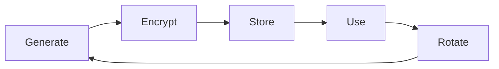

# 🔒 Fynlo POS Payment Security Guide

## Executive Summary

This guide documents the security measures implemented in the Fynlo POS payment system. The system has been designed with a security-first approach, implementing industry best practices for handling sensitive payment data while maintaining PCI compliance requirements.

**Key Security Principles:**
- No payment credentials stored in source code
- All sensitive data encrypted at rest
- Comprehensive audit logging
- Automatic security fallbacks
- Role-based access control

---

## Table of Contents

1. [Architecture Overview](#architecture-overview)
2. [Security Layers](#security-layers)
3. [Credential Management](#credential-management)
4. [Payment Processing Security](#payment-processing-security)
5. [Frontend Security](#frontend-security)
6. [Audit & Compliance](#audit--compliance)
7. [Security Checklist](#security-checklist)
8. [Incident Response](#incident-response)
9. [Developer Guidelines](#developer-guidelines)

---

## Architecture Overview

### Security-First Design

```
┌─────────────────┐     ┌─────────────────┐     ┌─────────────────┐
│                 │     │                 │     │                 │
│  React Native   │────▶│   FastAPI      │────▶│   PostgreSQL    │
│   Frontend      │HTTPS│   Backend      │     │   Database      │
│                 │     │                 │     │                 │
└─────────────────┘     └─────────────────┘     └─────────────────┘
        │                       │                       │
        │                       │                       │
    No Secrets            Rate Limited           Encrypted Storage
    Public Keys Only      Auth Required         Fernet Encryption
    Input Sanitized       Audit Logged          RBAC Enforced
```

### Data Flow Security

1. **Frontend → Backend**: HTTPS only, JWT authentication, sanitized inputs
2. **Backend → Providers**: Encrypted credentials, TLS 1.2+, webhook validation
3. **Backend → Database**: Encrypted at rest, parameterized queries, transaction isolation

---

## Security Layers

### Layer 1: Frontend Protection

**Implemented Measures:**
- ✅ No API keys or secrets in React Native code
- ✅ Payment details sanitized before transmission
- ✅ Public keys only for client-side operations
- ✅ Secure storage using AsyncStorage for tokens
- ✅ Certificate pinning for API communications (planned)

**Code Example:**
```typescript
// SecurePaymentOrchestrator.ts
private sanitizePaymentDetails(details: Record<string, any>): Record<string, any> {
  const sanitized = { ...details };
  
  // Remove sensitive fields
  const sensitiveFields = [
    'card_number', 'cvv', 'cvc', 'pin',
    'full_card_number', 'security_code'
  ];
  
  sensitiveFields.forEach(field => {
    delete sanitized[field];
  });
  
  return sanitized;
}
```

### Layer 2: API Security

**Implemented Measures:**
- ✅ JWT authentication on all payment endpoints
- ✅ Rate limiting (10 req/min payments, 5 req/min refunds)
- ✅ Input validation with Pydantic models
- ✅ Role-based permissions (refunds require manager+)
- ✅ Request context logging (IP, user agent)

**Configuration:**
```python
# secure_payments.py
@router.post("/process")
@limiter.limit("10/minute")  # Rate limiting
async def process_payment(
    payment_request: PaymentRequest,  # Pydantic validation
    current_user: User = Depends(get_current_user)  # Auth required
):
    # Process payment with security checks
```

### Layer 3: Data Encryption

**Implemented Measures:**
- ✅ Fernet symmetric encryption for credentials
- ✅ Environment-based encryption keys
- ✅ Automatic key rotation capability
- ✅ Encrypted storage in database
- ✅ No plaintext secrets in logs

**Encryption Implementation:**
```python
# secure_payment_config.py
def store_provider_config(self, credentials: Dict[str, Any]):
    # Encrypt credentials
    credentials_json = json.dumps(credentials)
    encrypted = self.cipher.encrypt(credentials_json.encode())
    
    # Store encrypted data
    config.encrypted_credentials = encrypted.decode()
    config.encryption_version = CURRENT_ENCRYPTION_VERSION
```

---

## Credential Management

### Storage Security

**Never Store in Code:**
- ❌ API Keys
- ❌ Secret Keys
- ❌ Webhook Secrets
- ❌ Database Passwords
- ❌ Encryption Keys

**Secure Storage Locations:**
- ✅ Environment variables (for encryption keys)
- ✅ Encrypted database fields (for provider credentials)
- ✅ AWS Secrets Manager (production)
- ✅ HashiCorp Vault (enterprise)

### Credential Lifecycle



1. **Generation**: Use cryptographically secure methods
2. **Encryption**: Fernet encryption before storage
3. **Storage**: PostgreSQL with encrypted fields
4. **Usage**: Decrypt only in memory, never log
5. **Rotation**: Regular key rotation schedule

### Environment Setup

```bash
# Generate encryption key
python -c "from cryptography.fernet import Fernet; print(Fernet.generate_key().decode())"

# Set in environment
export PAYMENT_CONFIG_ENCRYPTION_KEY="your-generated-key"

# Never commit .env files
echo ".env" >> .gitignore
```

---

## Payment Processing Security

### Transaction Security Flow

```python
# Secure payment processing steps
async def process_payment(self, request: PaymentRequest):
    # 1. Validate input
    self._validate_payment_request(amount, method)
    
    # 2. Create audit trail
    self._log_action('attempt', sanitized_data)
    
    # 3. Database transaction
    with self.db.begin():
        payment = self._create_payment_record()
        
        # 4. Try providers (lowest fee first)
        for provider in self._get_provider_priority():
            try:
                result = await provider.process()
                if result.success:
                    payment.status = 'completed'
                    self._log_action('success')
                    return result
            except Exception as e:
                self._log_action('failure', error=str(e))
                continue
    
    # 5. All providers failed
    raise PaymentProcessingError("All providers failed")
```

### Security Validations

**Amount Validation:**
```python
def _validate_payment_request(self, amount: Decimal, method: str):
    # Decimal precision
    if not isinstance(amount, Decimal):
        raise ValueError("Amount must be Decimal")
    
    # Range checks
    if amount <= 0 or amount > Decimal('10000'):
        raise ValueError("Invalid amount range")
    
    # Method validation
    if method not in VALID_PAYMENT_METHODS:
        raise ValueError("Invalid payment method")
```

### Provider Fallback Security

1. **Primary Provider Selection**: Based on lowest fees
2. **Automatic Fallback**: On failure, try next provider
3. **Error Isolation**: Provider errors don't expose internals
4. **Audit Trail**: Every attempt logged for compliance

---

## Frontend Security

### Secure Payment Flow

```typescript
// Frontend never handles sensitive data directly
async processPayment(request: PaymentRequest) {
    // 1. Validate locally
    const validation = SecurePaymentConfig.validateAmount(
        request.amount, 
        request.paymentMethod
    );
    
    // 2. Sanitize before sending
    const sanitized = {
        ...request,
        payment_details: this.sanitizePaymentDetails(request.payment_details)
    };
    
    // 3. Send to secure backend
    const response = await fetch('/api/payments/process', {
        method: 'POST',
        headers: {
            'Authorization': `Bearer ${token}`,
            'Content-Type': 'application/json'
        },
        body: JSON.stringify(sanitized)
    });
}
```

### UI Security Considerations

1. **Fee Transparency**: Always show processing fees
2. **Confirmation Dialogs**: Require explicit user confirmation
3. **Error Messages**: Never expose system internals
4. **Loading States**: Prevent double-submission
5. **Secure Storage**: Use AsyncStorage for sensitive data

---

## Audit & Compliance

### Comprehensive Audit Logging

**What We Log:**
```python
# payment_audit_logs table
{
    "payment_id": "uuid",
    "action": "attempt|success|failure|refund",
    "provider": "sumup|stripe|square",
    "user_id": "uuid",
    "ip_address": "192.168.1.1",
    "user_agent": "Mozilla/5.0...",
    "request_data": "{sanitized}",  # No sensitive data
    "response_data": "{sanitized}",  # No tokens/secrets
    "error_message": "Safe error message",
    "created_at": "2025-01-07T10:00:00Z"
}
```

**What We Never Log:**
- ❌ Full card numbers
- ❌ CVV/CVC codes
- ❌ API keys or secrets
- ❌ Unencrypted credentials
- ❌ Customer personal data

### PCI Compliance Considerations

1. **Tokenization**: Use provider tokens, never store card data
2. **Network Segmentation**: Isolate payment processing
3. **Access Control**: Role-based permissions
4. **Encryption**: TLS 1.2+ for all communications
5. **Monitoring**: Real-time fraud detection

### GDPR Compliance

1. **Data Minimization**: Only collect necessary data
2. **Right to Erasure**: Support data deletion
3. **Data Portability**: Export customer data
4. **Consent Management**: Track payment consent
5. **Breach Notification**: 72-hour response plan

---

## Security Checklist

### Development Phase

- [ ] No hardcoded credentials in code
- [ ] All API keys in environment variables
- [ ] Input validation on all endpoints
- [ ] Parameterized database queries
- [ ] Error messages don't expose internals
- [ ] Logging excludes sensitive data
- [ ] Dependencies are up to date
- [ ] Security headers configured

### Deployment Phase

- [ ] HTTPS enforced everywhere
- [ ] Database encryption enabled
- [ ] Backup encryption configured
- [ ] Firewall rules configured
- [ ] Rate limiting enabled
- [ ] Monitoring alerts set up
- [ ] Incident response plan ready
- [ ] Security audit completed

### Operational Phase

- [ ] Regular security updates
- [ ] Credential rotation schedule
- [ ] Access logs reviewed
- [ ] Penetration testing
- [ ] Compliance audits
- [ ] Team security training
- [ ] Incident drills
- [ ] Documentation updates

---

## Incident Response

### Security Incident Playbook

#### 1. Detection & Containment (0-15 minutes)
```bash
# Immediate actions
1. Identify the incident type
2. Isolate affected systems
3. Preserve evidence
4. Notify security team
```

#### 2. Investigation (15-60 minutes)
```bash
# Gather information
- Check audit logs
- Review access logs
- Analyze payment patterns
- Identify scope of breach
```

#### 3. Remediation (1-4 hours)
```bash
# Fix the issue
- Patch vulnerabilities
- Rotate credentials
- Update firewall rules
- Deploy fixes
```

#### 4. Recovery (4-24 hours)
```bash
# Restore service
- Verify fixes
- Resume operations
- Monitor closely
- Update documentation
```

#### 5. Post-Incident (24-72 hours)
```bash
# Learn and improve
- Root cause analysis
- Update procedures
- Team debriefing
- Customer notification (if required)
```

### Contact Information

**Security Team:**
- Email: security@fynlo.com
- Phone: +44 XXX XXXX XXXX
- Slack: #security-incidents

**External Contacts:**
- PCI Compliance: compliance@provider.com
- Legal Team: legal@fynlo.com
- PR Team: pr@fynlo.com

---

## Developer Guidelines

### Secure Coding Practices

#### 1. Never Trust User Input
```python
# Bad
amount = request.data['amount']
db.execute(f"INSERT INTO payments VALUES ({amount})")

# Good
amount = Decimal(str(request.validated_data['amount']))
db.execute("INSERT INTO payments VALUES (?)", [amount])
```

#### 2. Use Security Libraries
```python
# Encryption
from cryptography.fernet import Fernet

# Password hashing
from passlib.context import CryptContext

# JWT tokens
from jose import jwt

# Input validation
from pydantic import BaseModel, validator
```

#### 3. Secure Error Handling
```python
# Bad
try:
    process_payment()
except Exception as e:
    return {"error": str(e)}  # Exposes internals

# Good
try:
    process_payment()
except PaymentError as e:
    logger.error(f"Payment failed: {e}")
    return {"error": "Payment processing failed"}
```

#### 4. Security Testing
```python
# Test input validation
def test_payment_validation():
    with pytest.raises(ValueError):
        process_payment(amount=-100)  # Negative amount
    
    with pytest.raises(ValueError):
        process_payment(amount=1000000)  # Too large

# Test authentication
def test_requires_auth():
    response = client.post("/payments/process")
    assert response.status_code == 401
```

### Code Review Security Checklist

Before approving any payment-related PR:

- [ ] No hardcoded secrets
- [ ] Input validation present
- [ ] Error handling doesn't leak info
- [ ] Audit logging implemented
- [ ] Tests cover security cases
- [ ] Documentation updated
- [ ] Rate limiting considered
- [ ] OWASP Top 10 reviewed

### Security Resources

1. **OWASP Payment Security**: https://owasp.org/www-project-payment-security/
2. **PCI DSS Requirements**: https://www.pcisecuritystandards.org/
3. **NIST Cryptographic Standards**: https://csrc.nist.gov/projects/cryptographic-standards-and-guidelines
4. **EU GDPR Guidelines**: https://gdpr.eu/

---

## Appendix

### A. Encryption Key Generation

```python
#!/usr/bin/env python3
"""Generate secure encryption keys"""

from cryptography.fernet import Fernet
import secrets
import base64

# Fernet key for payment config
fernet_key = Fernet.generate_key()
print(f"PAYMENT_CONFIG_ENCRYPTION_KEY={fernet_key.decode()}")

# Random secret for JWT
jwt_secret = secrets.token_urlsafe(32)
print(f"JWT_SECRET_KEY={jwt_secret}")

# Webhook secret
webhook_secret = secrets.token_hex(32)
print(f"WEBHOOK_SECRET={webhook_secret}")
```

### B. Security Audit Script

```bash
#!/bin/bash
# security_audit.sh - Run security checks

echo "🔒 Running Security Audit..."

# Check for hardcoded secrets
echo "Checking for hardcoded secrets..."
grep -r "api_key\|secret_key\|password" --include="*.py" --include="*.ts" .

# Check for SQL injection vulnerabilities
echo "Checking for SQL injection risks..."
grep -r "execute.*%" --include="*.py" .

# Check dependencies
echo "Checking for vulnerable dependencies..."
pip-audit
npm audit

# Check for exposed ports
echo "Checking exposed ports..."
netstat -tuln

echo "✅ Security audit complete"
```

### C. Incident Response Template

```markdown
## Security Incident Report

**Incident ID**: SEC-2025-001
**Date**: 2025-01-07
**Severity**: High/Medium/Low
**Status**: Active/Contained/Resolved

### Summary
Brief description of the incident

### Timeline
- 10:00 - Incident detected
- 10:15 - Team notified
- 10:30 - Containment started
- 11:00 - Issue resolved

### Impact
- Systems affected
- Data exposed
- Customer impact

### Root Cause
Technical explanation

### Remediation
- Immediate fixes
- Long-term improvements

### Lessons Learned
- What went well
- What could improve
- Action items
```

---

**Document Version**: 1.0
**Last Updated**: January 2025
**Next Review**: April 2025
**Owner**: Fynlo Security Team

For security concerns or questions, contact: security@fynlo.com