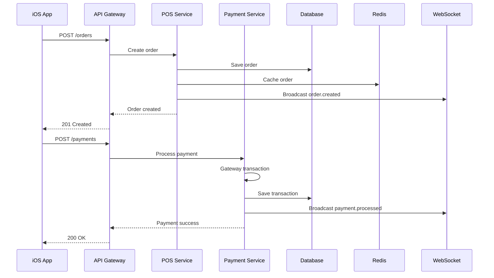

# 🏗️ Fynlo POS - System Architecture Overview

## Executive Summary
Fynlo POS is a modern, iOS-first restaurant point-of-sale system built on a robust, scalable architecture combining React Native for the frontend and a Python-based backend derived from Odoo/CashApp.

---

## 🎯 Architecture Principles

### Design Philosophy
- **Mobile-First**: Optimized for touch interfaces and mobile performance
- **Offline-Capable**: Core functions work without internet connectivity
- **Real-Time**: Live updates across all connected devices
- **Scalable**: Supports single location to enterprise chains
- **Secure**: PCI-compliant payment processing and data encryption
- **Modular**: Plugin architecture for custom features

---

## 📐 System Components

### High-Level Architecture
```
┌─────────────────────────────────────────────────────────────────┐
│                          Client Layer                            │
├─────────────────────┬───────────────────┬──────────────────────┤
│   iOS App (Staff)   │  Web Dashboard    │  Kitchen Display     │
│   React Native      │  React/Vue.js     │  Web App            │
└─────────────────────┴───────────────────┴──────────────────────┘
                                │
                    ┌───────────┴───────────┐
                    │   API Gateway         │
                    │   (REST + WebSocket)  │
                    └───────────┬───────────┘
                                │
┌─────────────────────────────────────────────────────────────────┐
│                      Application Layer                           │
├──────────────┬──────────────┬──────────────┬──────────────────┤
│  Auth Service│  POS Service │Payment Service│Analytics Service │
│  JWT/OAuth2  │  Orders/Menu │  Stripe/Apple│  Reporting      │
└──────────────┴──────────────┴──────────────┴──────────────────┘
                                │
┌─────────────────────────────────────────────────────────────────┐
│                        Data Layer                                │
├────────────────┬────────────────┬────────────────┬─────────────┤
│  PostgreSQL    │     Redis       │   File Storage │   Message   │
│  (Primary DB)  │    (Cache)      │   (S3/Local)   │   Queue     │
└────────────────┴────────────────┴────────────────┴─────────────┘
```

---

## 🔧 Component Details

### 1. Client Layer

#### iOS Application (React Native)
**Purpose**: Primary POS interface for restaurant staff
```typescript
// Technology Stack
- React Native 0.80.0
- TypeScript
- React Navigation
- Redux Toolkit / Zustand
- React Query (data fetching)
- React Native Reanimated 2
```

**Key Features**:
- Offline-first architecture
- Touch-optimized UI
- Biometric authentication
- Hardware integration (printers, cash drawers)

#### Web Dashboard
**Purpose**: Management and analytics interface
```javascript
// Technology Stack
- React 18+ or Vue.js 3
- TypeScript
- Chart.js / D3.js
- WebSocket for real-time
```

#### Kitchen Display System
**Purpose**: Order management for kitchen staff
```javascript
// Technology Stack
- Vanilla JS or React
- WebSocket connections
- High-contrast UI
- Touch gestures
```

---

### 2. API Gateway Layer

#### REST API Design
```yaml
Base URL: https://api.fynlo.com/v1

Authentication:
  - Bearer token (JWT)
  - API key for service-to-service
  
Rate Limiting:
  - 100 requests/minute per user
  - 1000 requests/minute per location
  
Versioning:
  - URL path versioning (/v1, /v2)
  - Sunset headers for deprecation
```

#### WebSocket Architecture
```javascript
// Real-time events
const events = {
  'order.created': { room: 'location:{id}' },
  'order.updated': { room: 'location:{id}' },
  'payment.processed': { room: 'location:{id}' },
  'table.status_changed': { room: 'location:{id}' },
  'kitchen.order_ready': { room: 'kitchen:{id}' }
};
```

---

### 3. Application Services

#### Authentication Service
**Responsibilities**:
- User authentication (staff, managers, admins)
- JWT token generation and validation
- Role-based access control (RBAC)
- Session management
- Device fingerprinting

**Security Features**:
```python
# Security implementation
- bcrypt password hashing
- JWT with refresh tokens
- OAuth2 for third-party integrations
- 2FA support
- Brute force protection
```

#### POS Service
**Core Business Logic**:
```python
class POSService:
    """Handles all POS operations"""
    
    def create_order(self, items, table_id, server_id):
        # Order creation logic
        # Inventory validation
        # Tax calculation
        # Discount application
        
    def process_payment(self, order_id, payment_method, amount):
        # Payment gateway integration
        # Receipt generation
        # Tip processing
        
    def manage_session(self, action, cash_amount=None):
        # Open/close POS session
        # Cash reconciliation
        # Report generation
```

#### Payment Service
**Payment Gateway Abstraction**:
```python
class PaymentGateway(ABC):
    @abstractmethod
    def authorize(self, amount, payment_method): pass
    
    @abstractmethod
    def capture(self, transaction_id): pass
    
    @abstractmethod
    def refund(self, transaction_id, amount): pass

class StripeGateway(PaymentGateway):
    # Stripe implementation
    
class SquareGateway(PaymentGateway):
    # Square implementation
```

#### Analytics Service
**Data Processing Pipeline**:
```python
# Real-time analytics
- Stream processing with Apache Kafka
- Aggregation with Redis
- Historical data in PostgreSQL
- Visualization API endpoints
```

---

### 4. Data Layer

#### PostgreSQL Schema
```sql
-- Core tables structure
CREATE TABLE locations (
    id SERIAL PRIMARY KEY,
    name VARCHAR(255),
    timezone VARCHAR(50),
    settings JSONB
);

CREATE TABLE pos_orders (
    id SERIAL PRIMARY KEY,
    location_id INTEGER REFERENCES locations(id),
    order_number VARCHAR(50),
    state VARCHAR(20),
    total_amount DECIMAL(10,2),
    created_at TIMESTAMP WITH TIME ZONE,
    completed_at TIMESTAMP WITH TIME ZONE
);

CREATE TABLE order_lines (
    id SERIAL PRIMARY KEY,
    order_id INTEGER REFERENCES pos_orders(id),
    product_id INTEGER,
    quantity DECIMAL(10,3),
    unit_price DECIMAL(10,2),
    modifiers JSONB
);

-- Indexes for performance
CREATE INDEX idx_orders_location_date ON pos_orders(location_id, created_at);
CREATE INDEX idx_orders_state ON pos_orders(state) WHERE state != 'completed';
```

#### Redis Caching Strategy
```javascript
// Cache keys structure
const cacheKeys = {
  products: 'products:location:{locationId}',
  menu: 'menu:location:{locationId}:active',
  session: 'session:user:{userId}',
  analytics: 'analytics:location:{locationId}:date:{date}'
};

// TTL configuration
const ttlConfig = {
  products: 300,      // 5 minutes
  menu: 900,          // 15 minutes
  session: 3600,      // 1 hour
  analytics: 60       // 1 minute
};
```

---

## 🔄 Data Flow Architecture

### Order Processing Flow


### Offline Sync Architecture
```typescript
// Client-side offline queue
interface OfflineQueue {
  pending: SyncItem[];
  failed: SyncItem[];
  syncing: boolean;
}

interface SyncItem {
  id: string;
  type: 'order' | 'payment' | 'customer';
  data: any;
  timestamp: Date;
  retries: number;
}

// Sync process
class SyncManager {
  async syncOfflineData() {
    const items = await getOfflineQueue();
    
    for (const item of items) {
      try {
        await this.syncItem(item);
        await removeFromQueue(item.id);
      } catch (error) {
        await incrementRetries(item.id);
        if (item.retries > MAX_RETRIES) {
          await moveToFailed(item.id);
        }
      }
    }
  }
}
```

---

## 🔐 Security Architecture

### Security Layers
1. **Network Security**
   - TLS 1.3 for all communications
   - Certificate pinning for mobile apps
   - VPN for inter-service communication

2. **Application Security**
   - Input validation and sanitization
   - SQL injection prevention
   - XSS protection
   - CSRF tokens

3. **Data Security**
   - Encryption at rest (AES-256)
   - Encryption in transit (TLS)
   - PCI DSS compliance
   - GDPR compliance

4. **Access Control**
   ```python
   # Role-based permissions
   PERMISSIONS = {
       'server': ['order.create', 'order.read', 'payment.process'],
       'manager': ['*'],  # All permissions
       'kitchen': ['order.read', 'order.update_status'],
       'cashier': ['order.create', 'order.read', 'payment.process', 'refund.create']
   }
   ```

---

## 🚀 Scalability Design

### Horizontal Scaling
```yaml
Load Balancer (nginx):
  - Round-robin distribution
  - Health checks
  - SSL termination

Application Servers:
  - Stateless design
  - Auto-scaling based on CPU/memory
  - Container orchestration (K8s)

Database:
  - Read replicas for analytics
  - Connection pooling (pgBouncer)
  - Partitioning by location/date
```

### Performance Optimizations
1. **Database**
   - Query optimization
   - Proper indexing
   - Materialized views for reports
   - Partitioning for large tables

2. **Caching**
   - Redis for hot data
   - CDN for static assets
   - Application-level caching
   - Database query caching

3. **Async Processing**
   - Message queues for heavy tasks
   - Background job processing
   - Event-driven architecture

---

## 🔌 Integration Points

### Third-Party Integrations
```javascript
// Payment Gateways
- Stripe
- Square
- PayPal
- Apple Pay

// Accounting Software
- QuickBooks
- Xero
- Sage

// Marketing Tools
- Mailchimp
- SendGrid
- Twilio (SMS)

// Hardware
- Star Micronics (printers)
- Epson (printers)
- APG (cash drawers)
- Ingenico (card readers)
```

### Webhook System
```python
@app.route('/webhooks/<integration>', methods=['POST'])
def handle_webhook(integration):
    # Verify webhook signature
    if not verify_signature(request):
        return jsonify({'error': 'Invalid signature'}), 401
    
    # Process webhook
    event_type = request.json.get('type')
    processor = WebhookProcessor.get(integration)
    
    return processor.handle(event_type, request.json)
```

---

## 📊 Monitoring & Observability

### Monitoring Stack
```yaml
Metrics:
  - Prometheus for metrics collection
  - Grafana for visualization
  - Custom dashboards per service

Logging:
  - Centralized logging (ELK stack)
  - Structured logging (JSON)
  - Log levels: ERROR, WARN, INFO, DEBUG

Tracing:
  - Distributed tracing (Jaeger)
  - Request ID propagation
  - Performance profiling

Alerting:
  - PagerDuty integration
  - Slack notifications
  - Email alerts
  - SMS for critical issues
```

### Health Checks
```python
@app.route('/health')
def health_check():
    checks = {
        'database': check_database(),
        'redis': check_redis(),
        'payment_gateway': check_payment_gateway(),
        'disk_space': check_disk_space(),
        'memory': check_memory()
    }
    
    status = 'healthy' if all(checks.values()) else 'unhealthy'
    status_code = 200 if status == 'healthy' else 503
    
    return jsonify({
        'status': status,
        'checks': checks,
        'timestamp': datetime.utcnow().isoformat()
    }), status_code
```

---

## 🔄 Deployment Architecture

### CI/CD Pipeline
```yaml
Pipeline Stages:
  1. Code Commit
     - Git hooks for linting
     - Commit message validation
  
  2. Build
     - Docker image creation
     - iOS app building
     - Asset compilation
  
  3. Test
     - Unit tests
     - Integration tests
     - E2E tests
  
  4. Deploy
     - Staging deployment
     - Smoke tests
     - Production deployment
     - Health checks
```

### Infrastructure as Code
```terraform
# Example Terraform configuration
resource "aws_ecs_service" "fynlo_api" {
  name            = "fynlo-api"
  cluster         = aws_ecs_cluster.main.id
  task_definition = aws_ecs_task_definition.api.arn
  desired_count   = var.app_count
  
  load_balancer {
    target_group_arn = aws_alb_target_group.api.arn
    container_name   = "fynlo-api"
    container_port   = 8000
  }
}
```

---

## 🎯 Future Architecture Considerations

### Microservices Migration
- Break monolith into services
- Service mesh (Istio)
- API gateway (Kong)
- Event sourcing

### Advanced Features
- AI-powered analytics
- Predictive inventory
- Voice ordering
- AR menu visualization

### Global Expansion
- Multi-region deployment
- Data residency compliance
- Currency/language support
- Local payment methods

---

This architecture provides a solid foundation for a scalable, maintainable, and secure POS system that can grow with business needs.