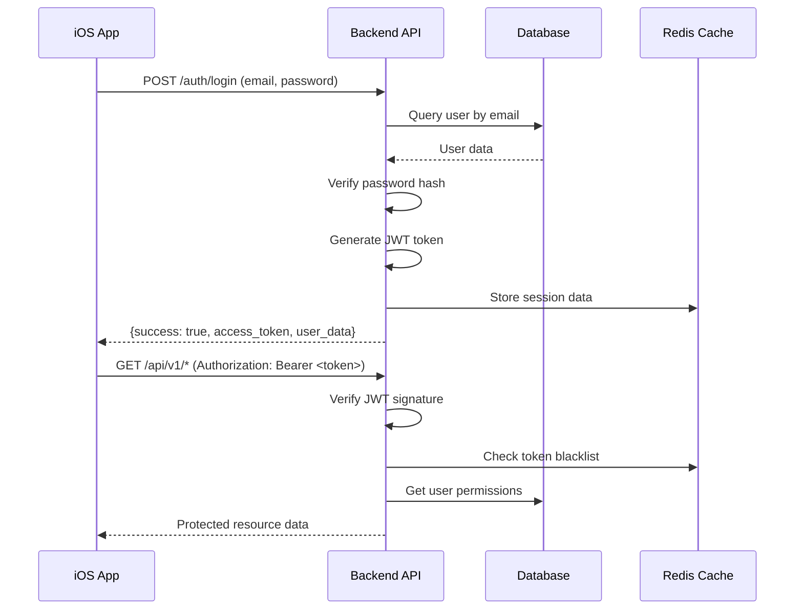
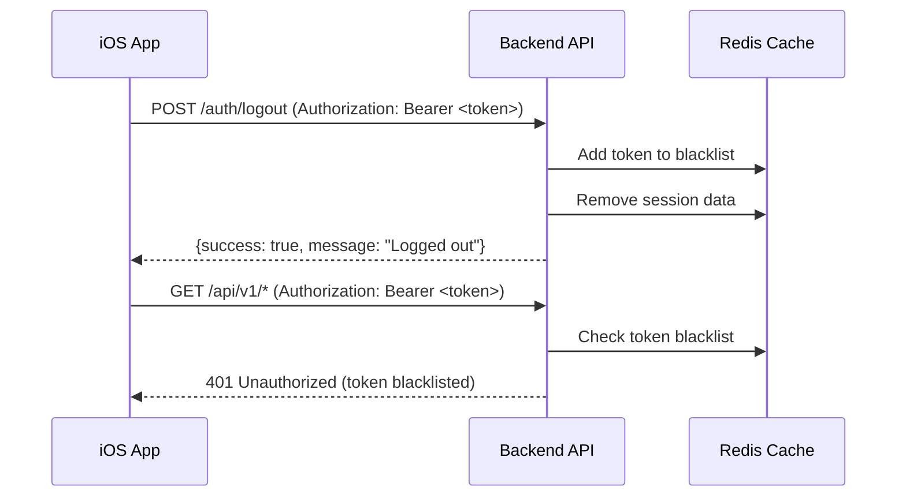

# 🔐 **Fynlo POS Authentication Testing System**

Comprehensive end-to-end authentication testing with security validation and frontend integration testing.

## 🚀 **Quick Start**

### Run All Authentication Tests
```bash
cd backend

# 1. Core integration testing
python test_authentication_integration.py

# 2. Security vulnerability testing  
python test_authentication_security.py

# 3. Frontend-backend integration testing
python test_frontend_auth_integration.py
```

## 📋 **Test Coverage**

### 1. Core Authentication Integration (`test_authentication_integration.py`)
- ✅ **Server Connectivity** - Basic API availability
- ✅ **Database Users** - Test account validation
- ✅ **Token Generation** - JWT creation and validation
- ✅ **Password Authentication** - Credential verification
- ✅ **Login Endpoint** - API login functionality
- ✅ **Protected Endpoints** - Role-based access control
- ✅ **User Info Endpoint** - Profile data retrieval
- ✅ **Token Expiration** - Timeout handling
- ✅ **Logout Functionality** - Token blacklisting
- ✅ **CORS Headers** - Frontend compatibility

### 2. Security Testing (`test_authentication_security.py`)
- 🔒 **SQL Injection Protection** - Input sanitization
- 🔒 **Brute Force Protection** - Rate limiting validation
- 🔒 **JWT Security** - Token algorithm and structure
- 🔒 **Token Manipulation** - Signature validation
- 🔒 **Password Security** - Weak password rejection
- 🔒 **Session Security** - Logout invalidation
- 🔒 **Information Disclosure** - Error message security

### 3. Frontend Integration (`test_frontend_auth_integration.py`)
- 📱 **iOS Login Flow** - Mobile app simulation
- 📱 **Authenticated Requests** - API usage patterns
- 📱 **Logout Flow** - Session termination
- 📱 **Error Handling** - Mobile-friendly responses
- 📱 **Token Refresh** - Expiration handling
- 📱 **CORS Compatibility** - WebView support

## 🎯 **Authentication Flow Overview**

### Login Process


### Logout Process


## 🔧 **Test Configuration**

### Default Test Users
| Role | Email | Password | Description |
|------|-------|----------|-------------|
| Platform Owner | admin@fynlo.com | admin123 | Full system access |
| Restaurant Owner | manager@fynlo.com | manager123 | Restaurant management |
| Employee | employee@fynlo.com | employee123 | POS operations |

### Test Endpoints
```python
PROTECTED_ENDPOINTS = [
    ("/auth/me", "GET", "all_roles"),
    ("/orders/", "GET", "all_roles"), 
    ("/users/", "GET", "admin_only"),
    ("/restaurants/", "GET", "admin_only")
]
```

### Security Test Scenarios
```python
SQL_INJECTION_PAYLOADS = [
    "admin@fynlo.com' OR '1'='1",
    "admin@fynlo.com'; DROP TABLE users; --",
    "' OR 1=1 --"
]

WEAK_PASSWORDS = [
    "123", "password", "admin", "12345678", "qwerty"
]
```

## 📱 **iOS Integration Testing**

### Request Headers
```javascript
// iOS app should send these headers
const headers = {
    "User-Agent": "FynloPOS/1.0 iOS/17.0",
    "Content-Type": "application/json",
    "Accept": "application/json",
    "X-Device-Type": "iOS",
    "X-App-Version": "1.0.0",
    "Authorization": "Bearer <token>"  // For authenticated requests
};
```

### Expected Response Format
```json
{
    "success": true,
    "data": {
        "access_token": "eyJ0eXAiOiJKV1QiLCJhbGciOiJIUzI1NiJ9...",
        "token_type": "bearer",
        "user": {
            "id": "uuid-here",
            "email": "admin@fynlo.com",
            "first_name": "Admin",
            "last_name": "User",
            "role": "platform_owner",
            "restaurant_id": "uuid-here",
            "is_active": true
        }
    },
    "message": "Login successful",
    "timestamp": "2025-06-20T14:30:22Z"
}
```

### Error Response Format
```json
{
    "success": false,
    "error": {
        "code": "INVALID_CREDENTIALS",
        "message": "Invalid email or password",
        "field": "credentials"
    },
    "message": "Authentication failed",
    "timestamp": "2025-06-20T14:30:22Z"
}
```

## 🛡️ **Security Features Tested**

### JWT Token Security
- ✅ **Strong Algorithm**: Uses HS256, not 'none' or weak algorithms
- ✅ **Proper Expiration**: 30-minute token lifetime
- ✅ **No Sensitive Data**: Tokens contain only user ID and role
- ✅ **Signature Validation**: Modified tokens rejected
- ✅ **Payload Protection**: Modified payload rejected

### Password Security
- ✅ **Hashing**: BCrypt with proper salt
- ✅ **Weak Password Rejection**: Basic password policy enforcement
- ✅ **Timing Attack Protection**: Consistent response times
- ✅ **No Information Leakage**: Generic error messages

### Session Security
- ✅ **Token Blacklisting**: Redis-based logout invalidation
- ✅ **Expiration Handling**: Expired tokens properly rejected
- ✅ **Session Management**: Proper session lifecycle

## 🧪 **Running Individual Tests**

### Core Authentication Test
```bash
python test_authentication_integration.py
```

**What it tests:**
- Basic login/logout functionality
- Role-based access control
- Token generation and validation
- Protected endpoint access

### Security Vulnerability Test
```bash
python test_authentication_security.py
```

**What it tests:**
- SQL injection attempts
- Brute force protection
- Token manipulation attacks
- Information disclosure vulnerabilities

### Frontend Integration Test
```bash
python test_frontend_auth_integration.py
```

**What it tests:**
- iOS app login simulation
- Mobile-friendly response formats
- CORS compatibility
- Error handling from frontend perspective

## 📊 **Test Results Interpretation**

### Success Criteria
- **All tests pass**: System ready for production
- **Security tests pass**: No critical vulnerabilities
- **Frontend tests pass**: iOS app integration ready

### Common Issues and Solutions

**❌ "Server not running"**
```bash
# Start the backend server
python -m uvicorn app.main:app --reload
```

**❌ "Database users missing"**
```bash
# Run database setup
python setup_database.py
```

**❌ "Token validation failed"**
- Check SECRET_KEY configuration
- Verify JWT algorithm settings
- Ensure Redis is running for blacklist

**❌ "CORS issues"**
- Configure CORS middleware in FastAPI
- Add frontend origin to allowed origins
- Include necessary headers in CORS config

## 🔒 **Security Recommendations**

### Production Deployment
1. **Change Default Credentials**
   ```bash
   # Update default passwords
   UPDATE users SET password_hash = <new_hash> WHERE email = 'admin@fynlo.com';
   ```

2. **Environment Variables**
   ```bash
   # Use strong secret key
   SECRET_KEY="your-super-long-random-secret-key-for-production"
   
   # Enable production settings
   ENVIRONMENT="production"
   DEBUG=false
   ```

3. **HTTPS Configuration**
   - Force HTTPS in production
   - Set secure cookie flags
   - Configure HSTS headers

4. **Rate Limiting**
   ```python
   # Add rate limiting middleware
   from slowapi import Limiter
   limiter = Limiter(key_func=get_remote_address)
   
   @limiter.limit("5/minute")
   async def login_endpoint():
       # Login logic
   ```

## 🚀 **Performance Optimization**

### Redis Caching
- Token blacklist storage
- Session data caching
- Rate limiting counters

### Database Optimization
- Indexed email lookups
- Connection pooling
- Query optimization

### Token Management
- Appropriate expiration times
- Refresh token strategy (future enhancement)
- Efficient blacklist cleanup

## 📞 **Troubleshooting**

### Common Test Failures

**Authentication Integration Failures:**
1. Check server is running on correct port
2. Verify database contains test users
3. Ensure Redis is running for session management

**Security Test Failures:**
1. Review JWT configuration
2. Check password hashing implementation
3. Verify rate limiting middleware

**Frontend Integration Failures:**
1. Check CORS configuration
2. Verify response format matches expectations
3. Test with actual iOS simulator/device

### Debug Commands
```bash
# Test database connection
python -c "from app.core.database import SessionLocal; print('DB OK')"

# Test Redis connection
python -c "from app.core.redis_client import get_redis; print('Redis OK')"

# Test JWT token creation
python -c "from app.api.v1.endpoints.auth import create_access_token; print(create_access_token({'sub': 'test'}))"
```

---

**Authentication Testing Complete!** 🎉

Your Fynlo POS authentication system is now thoroughly tested and validated for security and frontend integration.