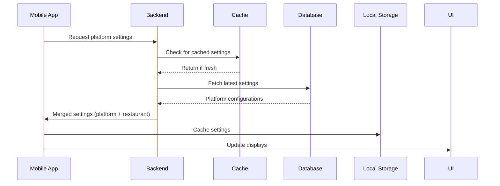

# Platform Settings Migration Plan

## Executive Summary

This document outlines the detailed implementation plan for migrating from restaurant-controlled settings to a platform-controlled hierarchy. The migration preserves demo functionality for investor presentations while establishing proper control over revenue-critical settings.

## Settings Migration Checklist

### ✅ Settings to Move to Platform Control

#### Payment & Financial Settings
- [ ] **Payment Processing Fees**
  - [ ] QR Payment: 1.2% (locked)
  - [ ] Stripe: 1.4% + 20p
  - [ ] Square: 1.75%
  - [ ] SumUp: 0.69% + £19/month
  - [ ] Cash: 0% (no fees)
- [ ] **Provider Configurations**
  - [ ] API credentials
  - [ ] Webhook endpoints
  - [ ] Environment settings (sandbox/production)
- [ ] **Smart Routing Rules**
  - [ ] Volume thresholds
  - [ ] Provider selection algorithms
  - [ ] Fallback configurations
- [ ] **Transaction Limits**
  - [ ] Minimum transaction amounts
  - [ ] Maximum transaction amounts
  - [ ] Daily/monthly limits

#### System & Compliance Settings
- [ ] **Security Requirements**
  - [ ] PCI compliance settings
  - [ ] Encryption standards
  - [ ] Authentication requirements
  - [ ] Session timeouts
- [ ] **Data Policies**
  - [ ] Retention periods
  - [ ] Backup schedules
  - [ ] Export limitations
  - [ ] Anonymization rules
- [ ] **API Configuration**
  - [ ] Rate limits
  - [ ] Quota allocations
  - [ ] Webhook retry policies
  - [ ] Timeout settings

#### Platform Features
- [ ] **Feature Flags**
  - [ ] Smart routing enabled/disabled
  - [ ] Analytics features
  - [ ] QR payments availability
  - [ ] Cash handling features
- [ ] **Integration Controls**
  - [ ] Available payment providers
  - [ ] Third-party integrations
  - [ ] API access levels
  - [ ] Export capabilities

### ✅ Settings to Keep at Restaurant Level

#### Business Information
- [ ] Company details (name, address, VAT number)
- [ ] Contact information
- [ ] Business registration details
- [ ] Banking information (for settlements)

#### Operational Settings
- [ ] Operating hours
- [ ] Holiday schedules
- [ ] Staff management
- [ ] Table configurations
- [ ] Service areas

#### Customer Experience
- [ ] Receipt customization
- [ ] Tipping policies
- [ ] Language preferences
- [ ] Customer display settings

#### Tax & Financial
- [ ] VAT rates and exemptions
- [ ] Service charge policies
- [ ] Discount limits (within platform bounds)
- [ ] Loyalty program settings

## Implementation Timeline

### Week 1: Backend Foundation

#### Day 1-2: Database Schema
```sql
-- Create platform settings schema
CREATE SCHEMA platform_config;

-- Platform configurations
CREATE TABLE platform_config.configurations (
    id UUID PRIMARY KEY DEFAULT gen_random_uuid(),
    key VARCHAR(255) UNIQUE NOT NULL,
    value JSONB NOT NULL,
    category VARCHAR(100) NOT NULL,
    description TEXT,
    is_sensitive BOOLEAN DEFAULT FALSE,
    validation_schema JSONB,
    created_at TIMESTAMP DEFAULT NOW(),
    updated_at TIMESTAMP DEFAULT NOW(),
    updated_by UUID REFERENCES auth.users(id)
);

-- Create indexes
CREATE INDEX idx_platform_config_category ON platform_config.configurations(category);
CREATE INDEX idx_platform_config_key ON platform_config.configurations(key);
```

#### Day 3-4: API Development
- Platform settings endpoints
- Validation service
- Audit logging
- Caching layer

#### Day 5: Testing & Documentation
- Unit tests for new services
- API documentation
- Integration test setup

### Week 2: Frontend Integration

#### Day 1-2: Platform Settings Store
```typescript
// src/store/usePlatformStore.ts
interface PlatformStore {
  // Payment configurations
  paymentFees: {
    qrCode: { percentage: 1.2, fixed: 0 };
    stripe: { percentage: 1.4, fixed: 0.20 };
    square: { percentage: 1.75, fixed: 0 };
    sumup: { percentage: 0.69, monthlyFee: 19 };
  };
  
  // Feature flags
  features: {
    smartRouting: boolean;
    analytics: boolean;
    qrPayments: boolean;
    cashPayments: boolean;
  };
  
  // Sync methods
  syncWithPlatform(): Promise<void>;
  getEffectiveSettings(): MergedSettings;
}
```

#### Day 3-4: UI Updates
- Update settings screens
- Add "Platform Managed" indicators
- Implement validation feedback
- Create sync status indicators

#### Day 5: Mobile Testing
- Test on iOS devices
- Test on Android devices
- Performance testing
- Offline capability testing

### Week 3: Data Migration

#### Day 1: Migration Scripts
```python
# Migration script to move settings to platform
def migrate_payment_settings():
    # Extract current payment fees from restaurants
    # Create platform configuration records
    # Set up restaurant overrides where needed
    # Validate all migrated data
```

#### Day 2-3: Staging Migration
- Run migration on staging environment
- Validate all settings
- Test with sample restaurants
- Performance benchmarking

#### Day 4-5: Production Preparation
- Create rollback plan
- Schedule maintenance window
- Prepare monitoring alerts
- Communication to restaurants

### Week 4: Platform Admin & Monitoring

#### Day 1-2: Admin Dashboard
- Platform settings management UI
- Bulk configuration tools
- Override approval workflow
- Analytics dashboard

#### Day 3-4: Monitoring Setup
- Configuration change alerts
- Sync failure monitoring
- Performance metrics
- Audit log analysis

#### Day 5: Documentation & Training
- Admin user guide
- Restaurant migration guide
- Support documentation
- Video tutorials

## Technical Implementation Details

### 1. Settings Synchronization Flow



### 2. Validation Logic

```typescript
// Validation service
class SettingsValidator {
  validateRestaurantOverride(
    key: string, 
    value: any, 
    platformLimit: any
  ): ValidationResult {
    switch(key) {
      case 'payment.markup':
        // Restaurant can add 0-0.5% markup
        return value >= 0 && value <= 0.5;
      
      case 'discount.maximum':
        // Cannot exceed platform maximum
        return value <= platformLimit;
      
      default:
        return true;
    }
  }
}
```

### 3. Offline Support

```typescript
// Offline-first architecture
class OfflineSettingsManager {
  async getSettings(): Promise<Settings> {
    // 1. Check local cache
    const cached = await LocalStorage.get('platform_settings');
    
    // 2. If online, sync with platform
    if (NetworkStatus.isOnline()) {
      try {
        const latest = await PlatformAPI.getSettings();
        await LocalStorage.set('platform_settings', latest);
        return latest;
      } catch (error) {
        // Fall back to cache
      }
    }
    
    // 3. Return cached or defaults
    return cached || DEFAULT_SETTINGS;
  }
}
```

## Risk Mitigation

### 1. Data Loss Prevention
- Full backup before migration
- Incremental migration approach
- Rollback procedures ready
- Data validation at each step

### 2. Service Disruption
- Migration during low-traffic hours
- Feature flags for gradual rollout
- Fallback to cached settings
- Real-time monitoring

### 3. Restaurant Impact
- Clear communication plan
- Support team briefing
- FAQ documentation
- Gradual rollout by region

## Success Metrics

### Technical Metrics
- [ ] 100% settings migrated successfully
- [ ] < 100ms settings sync time
- [ ] 99.9% sync success rate
- [ ] Zero data loss incidents

### Business Metrics
- [ ] Platform fee compliance: 100%
- [ ] Restaurant satisfaction: > 90%
- [ ] Support tickets: < 50 during migration
- [ ] Revenue impact: Positive within 30 days

## Post-Migration Tasks

### Week 5: Optimization
- Performance tuning
- Cache optimization
- API response optimization
- Database query optimization

### Week 6: Enhancement
- A/B testing framework
- Regional settings support
- Advanced analytics
- Automated compliance checks

## Rollback Plan

If critical issues arise:

1. **Immediate Actions** (< 5 minutes)
   - Switch feature flag to disable platform settings
   - Revert to restaurant-stored settings
   - Alert all stakeholders

2. **Short-term Fix** (< 1 hour)
   - Identify root cause
   - Deploy hotfix if possible
   - Communicate with affected restaurants

3. **Full Rollback** (< 4 hours)
   - Restore database from backup
   - Revert code deployment
   - Reset all configurations
   - Post-mortem analysis

## Conclusion

This migration plan ensures a smooth transition to platform-controlled settings while minimizing disruption to restaurant operations. The phased approach allows for validation at each step and provides multiple opportunities for course correction.