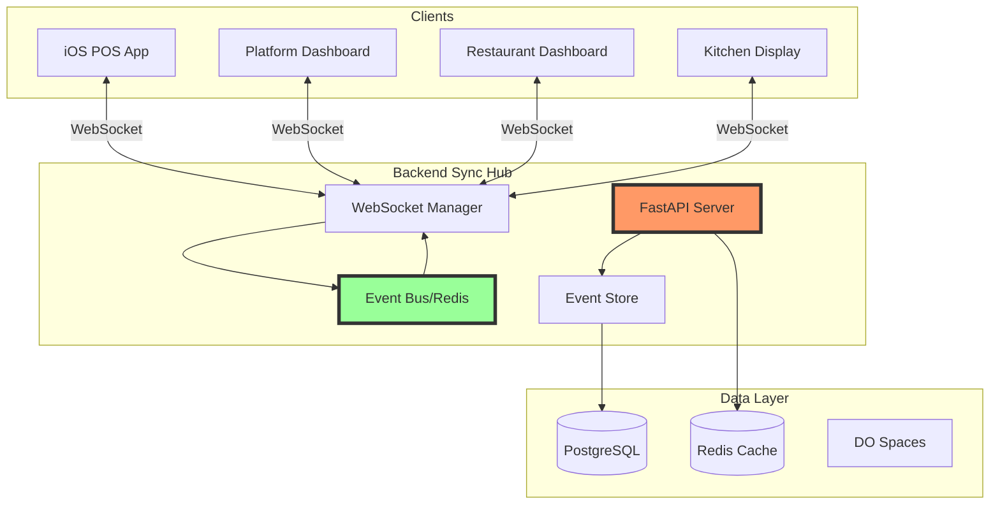

# Bidirectional Sync Architecture Plan for Fynlo POS

## Executive Summary

This document outlines the architecture and implementation plan for establishing bidirectional real-time synchronization between:
- **iOS/React Native POS App** (existing)
- **Backend API** (needs stabilization)
- **Web Dashboards** (to be built)
  - Platform Owner Dashboard
  - Restaurant Owner Dashboard

**Current State**: Backend instability is blocking real-time sync implementation.

## Critical Issues to Resolve First

### 1. Backend Timeout Issues (BLOCKER)
**Problem**: API endpoints timing out after 10+ seconds, especially on 401 retry requests.

**Root Causes Identified**:
- N+1 queries in menu and order endpoints
- Missing database indexes
- No query result caching
- Connection pool exhaustion

**Solutions**:
```python
# 1. Add eager loading to prevent N+1 queries
query = select(Product).options(
    selectinload(Product.category),
    selectinload(Product.modifiers),
    selectinload(Product.inventory_items)
)

# 2. Implement Redis caching
@cache_result(ttl=300)  # 5 minutes
async def get_menu_items(restaurant_id: str):
    # Query implementation
    pass

# 3. Optimize connection pool
engine = create_async_engine(
    DATABASE_URL,
    pool_size=20,
    max_overflow=40,
    pool_pre_ping=True,
    pool_recycle=3600
)
```

### 2. WebSocket Connection Stability
**Problem**: WebSocket connections dropping, authentication failing on reconnect.

**Current Implementation Issues**:
- No heartbeat mechanism
- Token expiry during active connections
- No automatic reconnection with backoff
- Memory leaks from orphaned connections

**Solutions**:
```python
# Backend WebSocket Manager with heartbeat
class WebSocketManager:
    def __init__(self):
        self.connections: Dict[str, Dict[str, Any]] = {}
        self.heartbeat_interval = 30  # seconds
        
    async def connect(self, websocket: WebSocket, restaurant_id: str, user_id: str):
        await websocket.accept()
        
        connection_id = str(uuid4())
        self.connections[connection_id] = {
            "websocket": websocket,
            "restaurant_id": restaurant_id,
            "user_id": user_id,
            "last_heartbeat": datetime.utcnow()
        }
        
        # Start heartbeat task
        asyncio.create_task(self._heartbeat_loop(connection_id))
        
    async def _heartbeat_loop(self, connection_id: str):
        while connection_id in self.connections:
            try:
                conn = self.connections[connection_id]
                await conn["websocket"].send_json({"type": "ping"})
                await asyncio.sleep(self.heartbeat_interval)
            except:
                await self.disconnect(connection_id)
                break
```

## Proposed Architecture

### Central Sync Hub Pattern



### Event Flow Architecture

1. **Event Generation**
   - Any client action generates an event
   - Events are immutable and timestamped
   - Each event has a unique ID and correlation ID

2. **Event Processing**
   ```python
   class Event(BaseModel):
       id: str = Field(default_factory=lambda: str(uuid4()))
       correlation_id: str
       aggregate_id: str  # restaurant_id, order_id, etc.
       event_type: str    # order.created, menu.updated, etc.
       payload: dict
       metadata: dict = Field(default_factory=dict)
       created_at: datetime = Field(default_factory=datetime.utcnow)
       created_by: str
   ```

3. **Event Distribution**
   ```python
   async def publish_event(event: Event):
       # 1. Store in event store for replay
       await event_store.append(event)
       
       # 2. Publish to Redis for real-time distribution
       channel = f"restaurant:{event.aggregate_id}:events"
       await redis.publish(channel, event.json())
       
       # 3. Update materialized views
       await update_projections(event)
   ```

## Implementation Phases

### Phase 1: Backend Stabilization (1 week)
1. **Fix timeout issues**
   - Add database indexes
   - Implement query optimization
   - Add Redis caching layer
   - Configure connection pooling

2. **Stabilize WebSocket connections**
   - Implement heartbeat mechanism
   - Add automatic reconnection
   - Handle token refresh during connection
   - Clean up orphaned connections

3. **Add monitoring**
   - Response time metrics
   - WebSocket connection metrics
   - Error tracking with Sentry
   - Database query performance

### Phase 2: Event Sourcing Infrastructure (1 week)
1. **Create event store**
   ```sql
   CREATE TABLE events (
       id UUID PRIMARY KEY,
       correlation_id UUID NOT NULL,
       aggregate_id VARCHAR NOT NULL,
       event_type VARCHAR NOT NULL,
       payload JSONB NOT NULL,
       metadata JSONB DEFAULT '{}',
       created_at TIMESTAMP NOT NULL,
       created_by UUID NOT NULL,
       INDEX idx_aggregate (aggregate_id, created_at),
       INDEX idx_correlation (correlation_id)
   );
   ```

2. **Implement event handlers**
   ```python
   event_handlers = {
       "order.created": handle_order_created,
       "order.updated": handle_order_updated,
       "menu.updated": handle_menu_updated,
       "inventory.adjusted": handle_inventory_adjusted,
   }
   ```

3. **Create projections**
   - Current orders view
   - Daily sales summary
   - Inventory levels
   - Employee activity

### Phase 3: Client Integration (1 week)
1. **Update iOS app WebSocket client**
   ```typescript
   class RealtimeSync {
     private ws: WebSocket;
     private reconnectAttempts = 0;
     private eventQueue: Event[] = [];
     
     connect() {
       this.ws = new WebSocket(`${WS_URL}?token=${this.token}`);
       
       this.ws.onmessage = (event) => {
         const data = JSON.parse(event.data);
         
         if (data.type === 'ping') {
           this.ws.send(JSON.stringify({ type: 'pong' }));
         } else {
           this.handleEvent(data);
         }
       };
       
       this.ws.onclose = () => {
         this.scheduleReconnect();
       };
     }
     
     private scheduleReconnect() {
       const delay = Math.min(1000 * Math.pow(2, this.reconnectAttempts), 30000);
       setTimeout(() => this.connect(), delay);
       this.reconnectAttempts++;
     }
   }
   ```

2. **Implement optimistic updates**
   - Update UI immediately
   - Queue events for server sync
   - Reconcile on confirmation
   - Handle conflicts

### Phase 4: Web Dashboard Integration (2 weeks)
1. **Build dashboard WebSocket clients**
2. **Implement real-time views**
   - Live order tracking
   - Real-time sales metrics
   - Inventory alerts
   - Employee activity feed

3. **Add bidirectional updates**
   - Menu changes from dashboard → POS
   - Inventory adjustments → All clients
   - Settings changes → Instant sync

## Data Synchronization Patterns

### 1. Optimistic Updates with Reconciliation
```typescript
// Client-side
async function createOrder(order: Order) {
  // 1. Generate client-side ID
  const clientId = generateClientId();
  order.id = clientId;
  
  // 2. Update local state optimistically
  orderStore.add(order);
  
  // 3. Send to server
  try {
    const serverOrder = await api.createOrder(order);
    // 4. Replace with server version
    orderStore.replace(clientId, serverOrder);
  } catch (error) {
    // 5. Rollback on failure
    orderStore.remove(clientId);
    showError('Order failed');
  }
}
```

### 2. Conflict Resolution
```python
# Server-side conflict resolution
async def resolve_conflict(client_event: Event, server_state: dict):
    if client_event.event_type == "inventory.adjusted":
        # Last-write-wins for inventory
        return client_event.payload
    
    elif client_event.event_type == "order.updated":
        # Merge non-conflicting fields
        merged = {**server_state, **client_event.payload}
        
        # Special handling for status changes
        if server_state["status"] == "completed":
            # Can't update completed orders
            raise ConflictError("Order already completed")
        
        return merged
```

### 3. State Synchronization
```python
# Periodic state reconciliation
async def sync_state(client_id: str, last_sync: datetime):
    # Get all events since last sync
    events = await event_store.get_events_since(last_sync)
    
    # Filter relevant events for client
    relevant_events = filter_by_permissions(events, client_id)
    
    # Send state snapshot + events
    return {
        "snapshot": await get_current_state(),
        "events": relevant_events,
        "sync_timestamp": datetime.utcnow()
    }
```

## Performance Considerations

### 1. Event Batching
```python
class EventBatcher:
    def __init__(self, batch_size=100, flush_interval=1.0):
        self.batch = []
        self.batch_size = batch_size
        self.flush_interval = flush_interval
        
    async def add_event(self, event: Event):
        self.batch.append(event)
        
        if len(self.batch) >= self.batch_size:
            await self.flush()
    
    async def flush(self):
        if self.batch:
            await self._send_batch(self.batch)
            self.batch = []
```

### 2. Subscription Management
```python
# Efficient subscription routing
class SubscriptionManager:
    def __init__(self):
        self.subscriptions: Dict[str, Set[str]] = defaultdict(set)
    
    def subscribe(self, client_id: str, pattern: str):
        self.subscriptions[pattern].add(client_id)
    
    async def publish(self, event: Event):
        # Find matching subscriptions
        for pattern, clients in self.subscriptions.items():
            if self._matches(event, pattern):
                for client_id in clients:
                    await self.send_to_client(client_id, event)
```

### 3. Caching Strategy
```yaml
# Cache layers
L1: Client-side cache (5 minutes)
  - Menu items
  - User preferences
  - Recent orders

L2: Redis cache (15 minutes)
  - Product catalog
  - Analytics summaries
  - User sessions

L3: Database materialized views
  - Daily reports
  - Inventory snapshots
  - Historical data
```

## Security Considerations

### 1. Event Authorization
```python
async def authorize_event(event: Event, user: User):
    # Check if user can perform this action
    if event.event_type.startswith("order."):
        return user.restaurant_id == event.aggregate_id
    
    if event.event_type.startswith("platform."):
        return user.role == "platform_owner"
    
    # Default deny
    return False
```

### 2. Data Filtering
```python
async def filter_event_payload(event: Event, user: User):
    # Remove sensitive data based on user role
    filtered = event.dict()
    
    if user.role != "owner":
        # Remove financial data
        filtered["payload"].pop("profit_margin", None)
        filtered["payload"].pop("cost", None)
    
    return filtered
```

## Testing Strategy

### 1. Load Testing
```bash
# WebSocket load test
locust -f websocket_load_test.py --host=wss://api.fynlo.co.uk

# Scenarios to test:
- 1000 concurrent connections
- 10,000 events per second
- Connection drops and reconnects
- Token expiry during connection
```

### 2. Sync Testing
```python
# Test event ordering
async def test_event_ordering():
    # Send events out of order
    await publish_event(Event(created_at=now + 10))
    await publish_event(Event(created_at=now))
    
    # Verify correct ordering on client
    assert client.events[0].created_at < client.events[1].created_at
```

## Monitoring & Observability

### 1. Key Metrics
- WebSocket connections (active, dropped, reconnects)
- Event latency (creation → delivery)
- Sync lag (server → client state)
- Conflict rate
- Cache hit rate

### 2. Alerts
- WebSocket connection drops > 5%
- Event delivery latency > 1 second
- Sync failures > 1%
- Database query time > 500ms

## Migration Plan

### Week 1: Backend Stabilization
- [ ] Fix database queries and indexes
- [ ] Implement Redis caching
- [ ] Stabilize WebSocket connections
- [ ] Add monitoring

### Week 2: Event Infrastructure
- [ ] Create event store
- [ ] Implement event publishing
- [ ] Build event handlers
- [ ] Create projections

### Week 3: Client Updates
- [ ] Update iOS WebSocket client
- [ ] Implement optimistic updates
- [ ] Add conflict resolution
- [ ] Test sync reliability

### Week 4-5: Dashboard Development
- [ ] Build dashboard framework
- [ ] Implement WebSocket client
- [ ] Create real-time views
- [ ] Test bidirectional sync

## Success Criteria

1. **Performance**
   - API response time < 200ms (p95)
   - WebSocket latency < 100ms
   - Zero message loss

2. **Reliability**
   - 99.9% uptime for sync service
   - Automatic recovery from failures
   - No data inconsistencies

3. **Scalability**
   - Support 10,000+ concurrent connections
   - Handle 100,000+ events per minute
   - Linear scaling with load

## Conclusion

The bidirectional sync architecture requires a stable backend as its foundation. The immediate priority is resolving timeout and WebSocket issues. Once stabilized, the event-sourced architecture will provide reliable, scalable real-time synchronization between all Fynlo POS components.